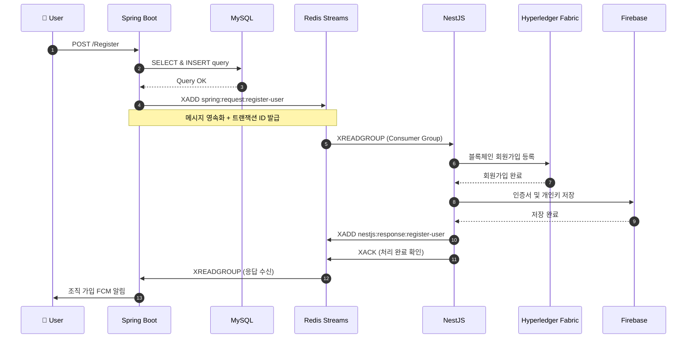
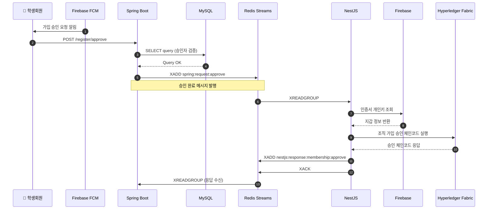
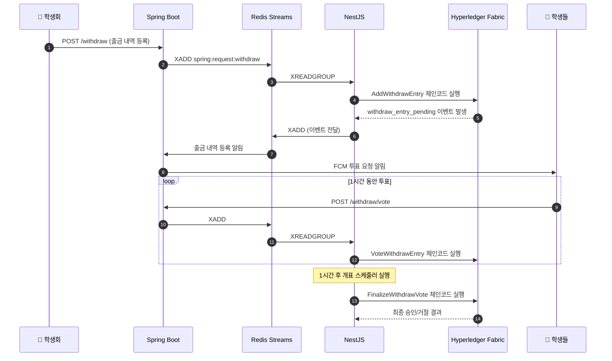

## [캡스톤디자인] Hyperledger 블록체인을 이용한 학생회 장부 시스템 - Scholarly Chain

**프로젝트 기간:** 2025.03.01 ~ 2025.06.03 <br>
**팀원:** 기획 및 디자인 1명, 프론트엔드 1명, 백엔드 1명, 블록체인 및 인프라 1명

### 프로젝트 주제: 
학생회비 장부를 학과 구성원들과 투명하게 공개하는 블록체인 기반 클라우드 네이티브 웹 서비스

### 프로젝트 목표: 
학생회만의 노력에 그치지 않고 학생들의 능동적인 참여를 바탕으로, 학생회 공금 횡령 문제를 예방하며 신뢰할 수 있는 학생 자치 문화를 형성하는 것

<br>

### 기술 스택


| 분류 | 기술 |
| --- | --- |
| Frontend | Next.js, Vercel |
| Backend | Spring Boot, NestJS, Firebase Cloud Messaging |
| Database | Redis, MySQL, Firebase |
| Blockchain | Hyperledger Fabric |
| Infra | AWS, Amazon EKS, Amazon S3 |

<br>

#### 왜 블록체인인가?
- 블록체인은 **탈중앙화, 투명성, 불변성, 합의 메커니즘, 스마트 컨트랙트**라는 다섯 가지 핵심 특징을 가짐
- 블록체인은 암호화 해시와 분산 네트워크 구조이기에 기록 조작이 불가능한 구조
- 모든 거래와 상태 변화가 블록에 순차적으로 기록되고 네트워크 전체에서 검증되기 때문에 승인 과정까지 투명하게 기록 가능
- 특히 Hyperledger Fabric은 허가형 네트워크로 사전 승인된 참여자들만 접근할 수 있고, 다중 조직의 합의를 통해 완전한 감사 추적이 가능

<br>

### 서비스 설명

**학생 입금 내역 신청과 학생회 출금 내역 신청**<br> 
학생) 행사명/연도/학기/금액/증빙 자료으로 입금 내역 신청<br>
학생회) 행사명/연도/학기/금액/증빙 자료으로 출금 내역 신청<br>
학생회 출금 내역 신청의 경우, **학생들이 학생회의 출금 내역을 보고 능동적으로 투표에 참여하여 해당 출금 내역을 허가할 것인지 선택 가능**


<br>

---

## 시스템 아키텍처

AWS EKS 기반 다중 가용영역(ap-northeast-2a, ap-northeast-2b) 클러스터로 구성
- **Frontend**: Next.js + Vercel 배포
- **Backend**: Spring Boot (프론트 통신), NestJS (블록체인 통신)
- **Blockchain**: Hyperledger Fabric 네트워크 (EKS 내 Pod로 운영)
- **Storage**: S3 (증빙 이미지), Firebase (인증서/개인키)


### 회원가입 흐름도



<br>

### 학생회 조직원 승인 흐름도



<br>

### 출금 내역 등록 및 투표 흐름도



<br>

---

## 기술적 의사결정: Redis Pub/Sub vs Redis Streams

### 문제 상황

본 프로젝트의 트랜잭션 흐름은 다음과 같이 **긴 체인 형태의 분산 트랜잭션**입니다:

```
Client → Spring (Gateway) → Redis → NestJS → Fabric SDK → Hyperledger Fabric → World State
                                         ↓
                                    Firebase (인증서 저장)
```

이 흐름에서 **어느 한 단계라도 실패하면 전체 트랜잭션이 실패**해야 합니다. 예를 들어:
- Fabric 체인코드 실행은 성공했지만 Firebase 인증서 저장이 실패한 경우
- NestJS에서 처리 중 서버가 크래시된 경우
- 네트워크 일시적 장애로 응답이 유실된 경우

이러한 상황에서 **데이터 정합성**을 보장하고, **실패 지점을 추적**하며, **보상 트랜잭션(Compensating Transaction)**을 실행할 수 있어야 합니다.

<br>

### Redis Pub/Sub의 한계

처음에는 구현이 단순한 **Redis Pub/Sub**을 고려했습니다. 그러나 다음과 같은 근본적인 한계가 있었습니다:

| 특성 | Pub/Sub | 우리 요구사항 |
|------|---------|---------------|
| **Delivery Semantics** | At-most-once (Fire-and-forget) | At-least-once 필요 |
| **메시지 영속성** | 없음 (메모리에만 존재) | 필요 (장애 복구) |
| **구독자 부재 시** | 메시지 유실 | 메시지 보존 필요 |
| **처리 확인** | 불가능 | ACK 기반 확인 필요 |
| **재처리** | 불가능 | 실패 시 재시도 필요 |
| **메시지 추적** | 불가능 | 트랜잭션 ID로 추적 필요 |
| **Consumer 장애 시** | 메시지 유실 | 다른 Consumer가 처리 |

```
[Pub/Sub의 치명적 문제]

Spring --publish--> Redis Pub/Sub ---> (NestJS 다운) ---> 메시지 유실 
                                                          ↓
                                              복구 불가능, 데이터 불일치
```

<br>

### Redis Streams 선택 이유

**Redis Streams**는 Apache Kafka에서 영감을 받은 append-only log 자료구조로, 분산 시스템에서 요구하는 **신뢰성 있는 메시지 전달**을 보장합니다.

#### 1. At-Least-Once Delivery with ACK

```typescript
// Consumer Group으로 메시지 수신
const messages = await redis.xreadgroup(
  'GROUP', consumerGroup, consumerName,
  'STREAMS', streamKey, '>'
);

// 비즈니스 로직 처리
await processMessage(messages);

// 처리 완료 후 ACK - 이 시점에서만 메시지가 "처리됨"으로 마킹
await redis.xack(streamKey, consumerGroup, messageId);
```

ACK 전에 서버가 크래시되면? → **Pending Entries List(PEL)**에 남아있어 다른 Consumer가 `XCLAIM`으로 재처리 가능

#### 2. 트랜잭션 추적 및 보상

```typescript
// 각 메시지에 고유한 트랜잭션 ID 포함
const transactionId = uuidv4();
await redis.xadd(streamKey, '*', 
  'transactionId', transactionId,
  'action', 'REGISTER_USER',
  'payload', JSON.stringify(data),
  'timestamp', Date.now()
);

// 실패 시 트랜잭션 ID로 추적하여 보상 트랜잭션 실행
if (fabricCallFailed) {
  await redis.xadd('compensation:stream', '*',
    'originalTransactionId', transactionId,
    'compensationAction', 'ROLLBACK_REGISTRATION'
  );
}
```

#### 3. Consumer Group을 통한 수평 확장 및 장애 대응

```
                    ┌─────────────────┐
                    │  Redis Streams  │
                    │  (spring:req)   │
                    └────────┬────────┘
                             │
              ┌──────────────┼──────────────┐
              ▼              ▼              ▼
        ┌──────────┐  ┌──────────┐  ┌──────────┐
        │ NestJS-1 │  │ NestJS-2 │  │ NestJS-3 │
        │(Consumer)│  │(Consumer)│  │(Consumer)│
        └──────────┘  └──────────┘  └──────────┘
              │              │              │
              └──────────────┼──────────────┘
                             ▼
                    ┌─────────────────┐
                    │    Fabric SDK   │
                    └─────────────────┘
```

- 동일 Consumer Group 내에서 메시지는 **한 번만** 처리됨
- Consumer 장애 시 해당 메시지는 다른 Consumer에게 재할당
- 수평 확장 시 자동으로 부하 분산

#### 4. Pending Entry List로 장애 복구

```bash
# 처리 중 장애가 발생한 메시지 조회
XPENDING spring:request:register-user consumer-group

# 일정 시간 이상 처리되지 않은 메시지 강제 재할당
XCLAIM spring:request:register-user consumer-group new-consumer 60000 <message-id>
```

<br>

### Trade-off 분석

| 측면 | Pub/Sub | Streams | 우리의 선택 |
|------|---------|---------|-------------|
| **구현 복잡도** | 낮음 | 중간 | Streams (복잡도 수용) |
| **메모리 사용량** | 낮음 | 높음 (로그 저장) | Streams (MAXLEN으로 제한) |
| **Latency** | ~0.1ms | ~0.5ms | Streams (블록체인 자체가 느림) |
| **신뢰성** | 낮음 | 높음 | Streams (필수) |
| **디버깅** | 어려움 | 용이 (메시지 추적) | Streams (운영 필수) |

블록체인 트랜잭션 자체가 수백ms ~ 수초가 걸리기 때문에, Streams의 추가 latency는 무시할 수 있는 수준입니다. 반면 **데이터 정합성과 장애 복구 능력**은 프로덕션 환경에서 필수적입니다.

<br>

### 결론

> **"분산 시스템에서 '메시지가 반드시 처리됨'을 보장해야 한다면, Fire-and-forget 방식의 Pub/Sub은 선택지가 될 수 없다."**

본 프로젝트는 Spring → NestJS → Fabric으로 이어지는 긴 트랜잭션 체인에서 **원자성(Atomicity)**을 보장하고, 실패 시 **추적 및 보상**이 가능해야 했습니다. Redis Streams는 이러한 요구사항을 충족하면서도 Kafka보다 운영 복잡도가 낮아 최적의 선택이었습니다.

---

<br>

## 체인코드 주요 로직

### (1) 학생/학생회 가입 신청 & 승인
- 성공적으로 스마트계약이 발생하면 계약이 생성되었다는 이벤트 발생
- 학생회원이 이전 스마트계약 RequestId로 승인 함수 실행시키면 Status를 PENDING → APPROVED로 변경

### (2) 입금 기입 요청/승인
- 요청한 사람이 학생 조직원인지 검사
- PENDING 상태의 이전의 정의한 장부 구조체를 이용한 스마트 계약 생성
- 승인한 유저가 학생회원인지 검사 후 PENDING → APPROVED로 상태 변경

### (3) 출금 기입 요청/승인
- 학생회 구성원인지 판단하고 지출내역 추가 체인코드 함수 실행
- 1시간 동안 유효한 투표를 발생하고 1시간 동안 모인 학생들의 승인/거절 비율로 결정
- 주기적으로 NestJS 서버에서 이 투표가 1시간 지났는지 검사를 한 후 지났으면 개표하도록 함

<br>

---

## 이벤트 기반 아키텍처

### 순환 참조 문제와 해결

**문제 상황**: Spring의 서비스A가 NestJS 이벤트를 구독하고 동시에 서비스B가 NestJS로부터 오는 다른 메시지를 처리하는데, 처리 과정에서 서비스A가 서비스B를 참조하고, 서비스B도 서비스A를 참조하는 순환 참조 문제가 발생

```
the dependencies of some of the beans in the
application context form a cycle:

┌─────────────────────┐
│ committeePublisher  │
↑                     ↓
│ committeePubSubService │
└─────────────────────┘
```

**해결 방법**: 구독을 이벤트 리스너를 사용하여 비동기/단방향으로 처리
- 이벤트 처리 리스너는 @EventListener로 동작
- Spring ↔ Redis ↔ NestJS 간 Pub/Sub 메시지 통신

<br>

---

## SDK를 통한 블록체인 & 백엔드 통신

### 블록체인과 직접적인 통신
- NestJS에서 Fabric SDK를 통해 체인코드 함수 직접 호출
- Firebase에서 승인자 정보 가져오기 → 학생회 구성원 확인 → 트랜잭션 실행

### 블록체인 이벤트 구독
- 체인코드에서 발생하는 이벤트(예: withdraw_entry_pending)를 NestJS에서 리스너로 등록
- 이벤트 발생 시 캐시 무효화 및 Spring에 이벤트 발행

<br>

---

## 부가 기능

### FCM 알림 전송
- 사용 용도: 해당 서비스에 가입한 모든 학생과 학생회에게 알림 전송
- Firebase SDK를 사용
- 로그인 시 프론트가 발급한 fcmToken을 DB에 저장
- 사용자별로 토큰 저장/갱신
- 알림 전송 - 서버가 토큰 조회 후 FCM API로 전송
- 로그아웃 - 토큰 삭제

### S3 이미지 업로드
- 사용 용도: 입금 내역, 출금 내역을 기입할 때 실제 송금, 출금한 내역, 영수증을 캡쳐한 이미지를 업로드
- AWS SDK 사용
- 사용자가 업로드할 파일명의 URL을 생성
- 프론트가 이미지 업로드
- 업로드 성공 후, 해당 이미지의 URL을 DB에 저장
